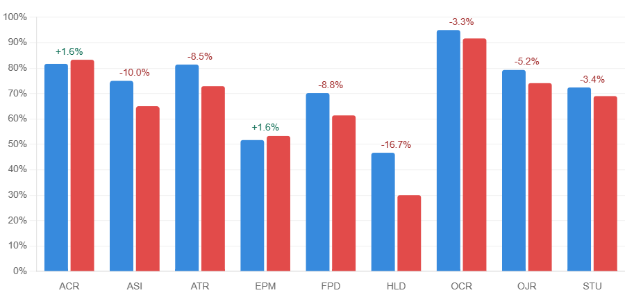
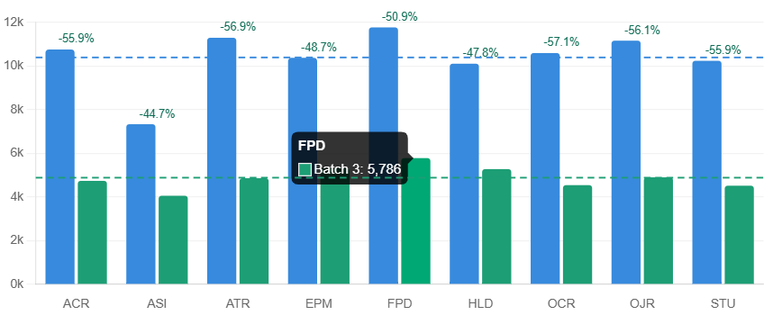
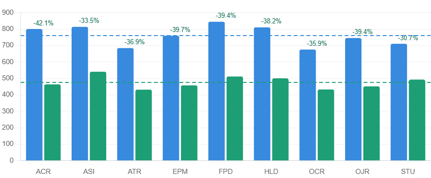
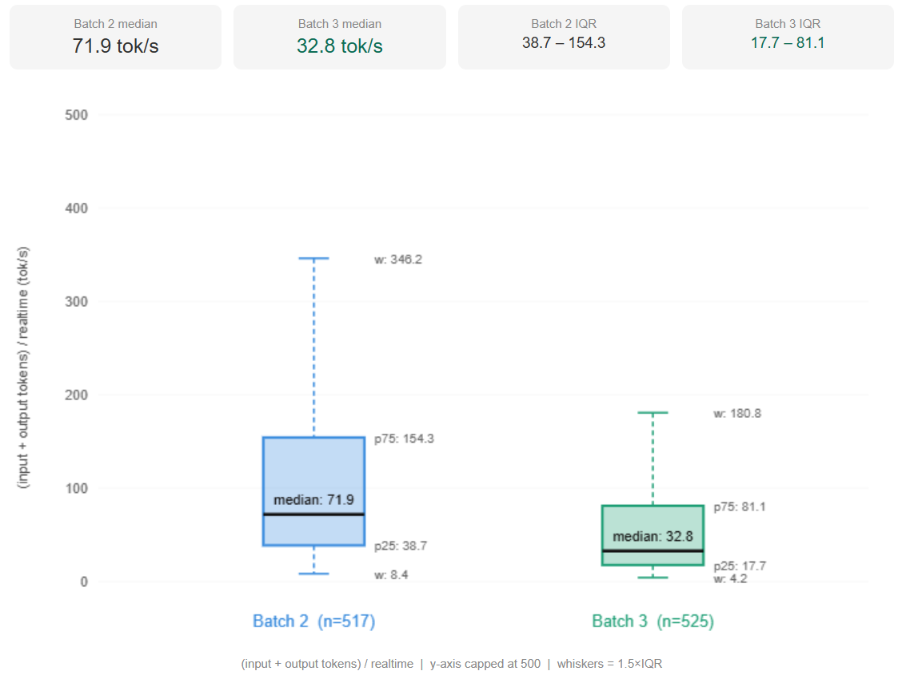
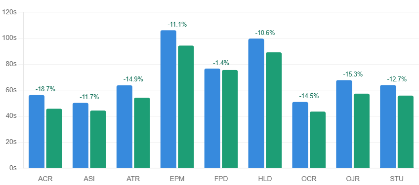
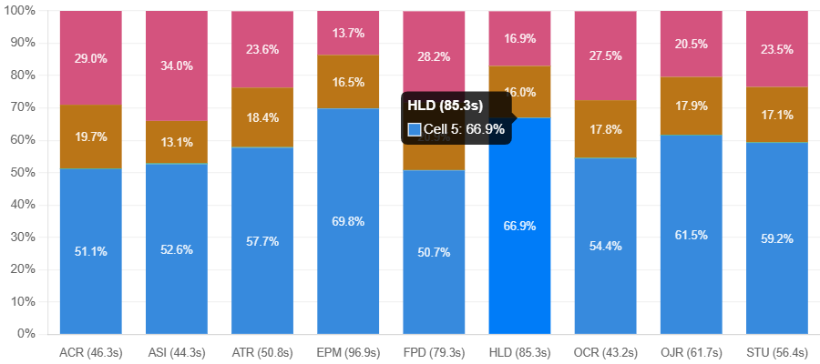
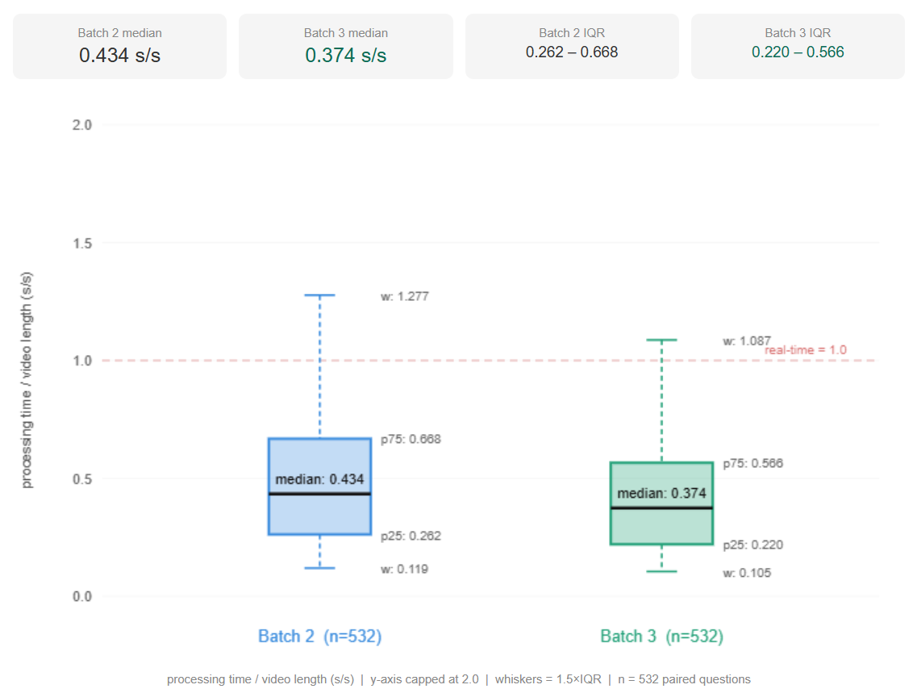

# Token-Efficient Multi-Source Frame Selection for Video Understanding

### Comic Book Hypothesis — Phase 3

[](https://opensource.org/licenses/MIT)
[](https://github.com/Cheng-Je-Lee/video-understanding-multi-source-keyframe-II)
[](https://github.com/JoeLeelyf/OVO-Bench)
[](https://github.com/Cheng-Je-Lee/video-understanding-multi-source-keyframe-II)

> This research was developed and tested collaboratively by an independent researcher and Claude Sonnet 4.6, without institutional affiliation. All development and experiments were conducted on Google Colab L4 GPU.
>
> **Part 3 of a 3-paper series** on sparse video understanding.
>
> - Part 1: Keyframe distillation — [`video-understanding-CBH`](https://github.com/Cheng-Je-Lee/video-understanding-CBH)
> - Part 2: Multi-source superposition architecture — [`video-understanding-multi-source-keyframe`](https://github.com/Cheng-Je-Lee/video-understanding-multi-source-keyframe)
> - Part 3 (this repo): Token-efficient prompt compression + K_SIGMOID dynamic routing — *CBH Phase 3*

---

## Overview

This system extends Phase 2's multi-source keyframe selection framework by compressing the visual material and simplifying the Chain-of-Thought prompt, reducing average input tokens by 53% and output tokens by 37%, while cutting processing time by 12%. Parameter optimization adopts both Random Forest and XGBoost as proxy models, with Optuna Bayesian search applied independently per question type.

The framework is evaluated on [OVO-Bench](https://github.com/JoeLeelyf/OVO-Bench) (CVPR 2025) across 720 questions spanning 9 task types, achieving **66.2% overall accuracy**.

---

## Key Improvements over Phase 2

| Component | Phase 2 | Phase 3 |
|---|---|---|
| CoT steps | 4-step (Parse → Evidence → Answer → Counterfactual) | 3-step (Identify → Evidence → Answer) |
| Confidence scoring | 0–10 scale | 0–5 scale |
| K_SIGMOID | Fixed static (6.0) | Dynamic per question type (Optuna search 2.0–10.0) |
| MAX_N_SMALL | Optuna search space | Fixed static (8) |
| YOLO crops | Key frames only | 5 source frames, max 2 objects each, 280px |
| Avg input tokens | 10,398 | 4,889 (−53%) |
| Avg output tokens | 761 | 476 (−37%) |
| Avg processing time | 70.7s | 62.3s (−12%) |

---

## Core Architecture

The overall pipeline follows Phase 2 — whole-video CLIP encoding → question classification → T_event localization → four-source window expansion → auxiliary analysis → LLM reasoning. This section describes Phase 3-specific changes only. For the full architecture, see [Phase 2](https://github.com/Cheng-Je-Lee/video-understanding-multi-source-keyframe).

### Prompt Compression

The Chain-of-Thought prompt is compressed from 4 steps to 3:

```
Step 1 — Identify in 1 sentence: subject, object, action, and time direction (current/past/future/sequential).
Step 2 — What is the strongest visual evidence from the frames? (2-3 sentences max)
Step 3 — State your answer and reasoning.
```

Step 4 (Counterfactual check) is removed because the confidence scoring mechanism already handles option elimination. The confidence scale is also compressed from 0–10 to 0–5, with UTA (Unable to Answer) elimination triggered when all concrete options score below 3.

### K_SIGMOID Dynamic Routing

In Phase 2, `K_SIGMOID` controlled sigmoid sharpness in the keyframe window sampling but was fixed at 6.0. In Phase 3, it is promoted into the per-question-type Optuna search space (range: 2.0–10.0), replacing `MAX_N_SMALL` which becomes a fixed static parameter (8).

Lower `K_SIGMOID` → uniform sampling distribution across the window.
Higher `K_SIGMOID` → sampling concentrated near the keyframe anchor.

### YOLO Crops Expansion

YOLO-World object crops are extracted from 5 source frames per question (T_event, T_event±1, realtime, realtime−1), with a maximum of 2 objects per frame, resized to 280px long edge. These crops are classified into the four material categories and included in the LLM prompt alongside keyframes.

### Question-Type Focus Instructions

Per-question-type attention guidance is expanded with additional keyword triggers:

| Type | Additional triggers |
|---|---|
| `action` | `after/next/then/following` → SEQUENCE hint; `before/prior` → PRIOR EVENT hint; `what does/what was` |
| `spatial` | `which side/hand/direction`, `facing/towards/away` |
| `attribute` | `what color/kind/type/size`, `number of` |

---

## Parameter System

### Dynamic Routing — Optuna-Optimized Parameters per Question Type

The 7 tunable parameters (with `K_SIGMOID` replacing `MAX_N_SMALL` vs Phase 2) are optimized using a Random Forest proxy model trained on labeled examples, with Optuna Bayesian search (2000 trials per type). XGBoost is used as an alternative proxy model for cross-validation.

| Parameter | Description | action | attribute | spatial |
|---|---|---|---|---|
| `REALTIME_NEAR_N` | Frames around realtime anchor | 6 | 6 | 7 |
| `BIG_WINDOW_BASE_SIGMA` | Big window spread (seconds) | 125.4427 | 146.3926 | 124.8741 |
| `DEDUP_THRESH_D` | Dedup threshold, big window | 0.9900 | 0.9900 | 0.8501 |
| `STU_MOVE_THRESH` | Motion detection sensitivity | 0.0345 | 0.0246 | 0.0115 |
| `K_SIGMOID` | Sigmoid sharpness, keyframe window | 2.1799 | 2.0156 | 3.0265 |
| `SEMANTIC_NEAR_N` | Frames dense-sampled near T_event | 2 | 3 | 5 |
| `DEDUP_THRESH_A` | Dedup threshold, keyframe window | 0.9899 | 0.9899 | 0.9899 |

### Fixed Parameters (13)

| Parameter | Value | Role |
|---|---|---|
| `BIG_WINDOW_K` | 1.0 | Big window sigma multiplier |
| `BIG_WINDOW_EPS` | 0.01 | Sigma floor guard |
| `BIG_WINDOW_BASE_N` | 16 | Base frame budget for big window |
| `MIN_INTERVAL_BIG` | 0.5s | Minimum frame spacing, big window |
| `MIN_INTERVAL_SMALL` | 0.25s | Minimum frame spacing, small windows |
| `MAX_N_SMALL` | 8 | Max frames per keyframe segment (static) |
| `SEMANTIC_NEAR_INTERVAL` | 0.25s | Dense sampling interval near T_event |
| `REALTIME_NEAR_INTERVAL` | 0.25s | Dense sampling interval near realtime |
| `STU_AREA_THRESH` | 0.10 | Object area change threshold |
| `CLIP_DEDUP_THRESH` | 0.95 | Legacy dedup (compatibility) |
| `K` | 0.3 | TDC threshold coefficient |
| `ALPHA` | 1.0 | TDC r₀ coefficient |
| `BETA` | 1.0 | TDC λ coefficient |

---

## Parameter Optimization Pipeline

1. **Proxy model training** — Random Forest (200 trees, max depth 5) and XGBoost (100 trees, max depth 3, reg_lambda=10) trained on labeled questions using 7 tunable + 13 fixed parameters + question type one-hot as features, smoothed weighted score as regression target (`Data_Augmentation_v3.ipynb` / `CBH_XGBoost_Optimizer.ipynb`).

2. **Cross-model selection** — Final parameters selected per question type by taking the highest predicted score across RF and XGBoost outputs.

3. **Optuna search** — 500–2000 Bayesian trials per question type on the proxy model.

### Optuna Search Ranges

| Parameter | Range |
|---|---|
| `REALTIME_NEAR_N` | 1 – 8 (int) |
| `BIG_WINDOW_BASE_SIGMA` | 50.0 – 150.0 |
| `DEDUP_THRESH_D` | 0.85 – 0.99 |
| `STU_MOVE_THRESH` | 0.005 – 0.05 |
| `K_SIGMOID` | 2.0 – 10.0 |
| `SEMANTIC_NEAR_N` | 1 – 8 (int) |
| `DEDUP_THRESH_A` | 0.85 – 0.99 |

---

## Results

### Final Evaluation (720 questions)

| Task | Questions | Accuracy | Weighted Score |
|---|---|---|---|
| OCR | 80 | **88.8%** | 0.888 |
| ACR | 80 | 77.5% | 0.800 |
| ATR | 80 | 78.8% | 0.813 |
| OJR | 80 | 75.0% | 0.775 |
| STU | 80 | 70.0% | 0.725 |
| FPD | 80 | 63.7% | 0.663 |
| ASI | 80 | 60.0% | 0.620 |
| EPM | 80 | 50.0% | 0.513 |
| HLD | 80 | 32.5% | 0.338 |
| **Overall** | **720** | **66.2%** | **0.674** |

### Paired Comparison vs Phase 2 (532 overlapping questions)

| Task | Phase 2 | Phase 3 | Δ |
|---|---|---|---|
| ACR | 81.7% | 83.3% | **+1.7%** |
| EPM | 51.7% | 53.3% | **+1.7%** |
| STU | 72.4% | 69.0% | −3.4% |
| OCR | 95.0% | 91.7% | −3.3% |
| OJR | 79.3% | 74.1% | −5.2% |
| ATR | 81.4% | 72.9% | −8.5% |
| FPD | 70.2% | 61.4% | −8.8% |
| ASI | 75.0% | 65.0% | −10.0% |
| HLD | 46.7% | 30.0% | −16.7% |
| **Overall** | **72.6%** | **66.7%** | **−5.8%** |



### Token Efficiency (paired, 532 questions)

| Metric | Phase 2 | Phase 3 | Δ |
|---|---|---|---|
| Avg input tokens | 10,398 | 4,889 | **−53%** |
| Avg output tokens | 761 | 476 | **−37%** |
| Median tok/s (input+output)/realtime | 71.9 | 32.8 | **−54%** |
| Avg processing time | 70.7s | 62.3s | **−12%** |







### Processing Time Breakdown (Phase 3, 720 questions)

Cell 5 (SigLIP encoding) dominates processing time across all task types (50–70%), with a strong linear relationship to video length (Pearson r = 0.74, Cell 5 ≈ 0.130 × realtime + 9.30s).







---

## Installation & Usage

### Running on Google Colab (T4 / A100 GPU)

**Step 1 — Mount Drive and install dependencies**

```bash
from google.colab import drive
drive.mount('/content/drive')
```

```bash
!pip install -q openai-whisper
!pip install -q git+https://github.com/openai/CLIP.git
!pip install -q ultralytics
!pip install -q anthropic spacy scipy xgboost optuna
!python -m spacy download en_core_web_sm
!apt-get install -y ffmpeg -q
```

**Step 2 — Upload notebooks**

Upload `ovo_stm_eval_v8_valid.ipynb`, `Data_Augmentation_v3.ipynb`, and `CBH_XGBoost_Optimizer.ipynb` to your Colab session or Drive.

**Step 3 — Set your API key in Cell 1**

Open `ovo_stm_eval_v8_valid.ipynb` and replace `YOUR_API_KEY_HERE` in Cell 1 with your Anthropic API key. Set the OVO-Bench video path and question IDs in the same cell.

**Step 4 — Run cells sequentially**

For single-question evaluation, execute Cell 1 through Cell 9 in order.

For batch evaluation, execute Cell 1–4 first (environment + model loading), then run Cell 10. Cell 10 reads `ovo_stm_eval_v8_valid.ipynb` as a loop controller — set `run_ids` to the list of question IDs you want to evaluate and it will automatically execute Cell 5–9 for each question.

**Step 5 — Parameter optimization (optional)**

To re-run proxy model optimization on new data:

1. Run `Data_Augmentation_v3.ipynb` (Random Forest) or `CBH_XGBoost_Optimizer.ipynb` (XGBoost) on your result JSONs
2. Select the highest predicted score per question type across both models
3. Copy the output parameters back into Cell 1 of `ovo_stm_eval_v8_valid.ipynb`

> ⚠️ Never hardcode your API key before pushing to a public repository. Use `YOUR_API_KEY_HERE` as a placeholder or load from environment variables.

---

## Repository Structure

```
├── ovo_stm_eval_v8_valid.ipynb     # Main evaluation pipeline (Phase 3)
├── Data_Augmentation_v3.ipynb      # Random Forest proxy + Optuna optimization
├── CBH_XGBoost_Optimizer.ipynb     # XGBoost proxy + Optuna optimization
├── question_weights.json           # Per-question smoothed scoring table
├── question_split.json             # Question ID allocation
└── results/
    ├── validation_merged.json      # 720-question final evaluation
    └── validation_merged.csv       # 720-question CSV with all fields
```

> **Note on question data**: Original questions sourced from OVO-Bench (CC BY-NC-SA 4.0).
> `question_split.json` contains item IDs only. Full questions available at [JoeLeelyf/OVO-Bench](https://github.com/JoeLeelyf/OVO-Bench).

---

## Requirements

```
python >= 3.10
torch
clip (openai/CLIP)
openai-whisper
ultralytics          # YOLOv8 + YOLO-World
transformers         # CLIP-Seg, SigLIP2
scikit-learn
xgboost
optuna
anthropic
spacy + en_core_web_sm
opencv-python
scipy
```

---

## Related Work

This is Part 3 of the Comic Book Hypothesis (CBH) project, a training-free inference-time framework for video narrative understanding.

- Part 1 evaluates long-term memory on Video-MME (84 videos) using Phi-3 Vision compression.
- Part 2 introduces the multi-source superposition architecture evaluated on OVO-Bench (532 questions).
- Part 3 (this repo) reduces input token consumption by 53% and output tokens by 37% through visual material compression and prompt simplification, with processing time reduced by 12%, extending evaluation to 720 questions.

---

## Citation

```bibtex
@software{lee2026cbh3,
  title  = {Token-Efficient Multi-Source Frame Selection for Video Understanding},
  author = {Lee, C.J.},
  year   = {2026},
  note   = {Comic Book Hypothesis — Phase 3, independent research},
  url    = {https://github.com/Cheng-Je-Lee/video-understanding-multi-source-keyframe-II}
}
```

---

## License

MIT License
